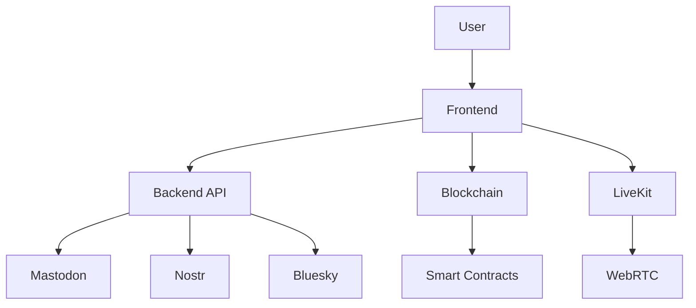

# Decentralized Social Media Aggregator - Frontend


## Overview
This frontend application provides a TikTok-style interface for browsing content from decentralized social networks (Mastodon, Nostr, Bluesky) with on-chain engagement tracking. Built with React, Web3.js, and LiveKit for real-time interactions.

## Key Features
- 🎥 **TikTok-style vertical video feed**
- 🔗 **Multi-wallet support** (MetaMask, WalletConnect, etc.)
- ❤️ **On-chain engagement tracking** (likes, reposts, comments)
- 💬 **Real-time comment system** using LiveKit
- 🌐 **Multi-platform aggregation** (Mastodon, Nostr, Bluesky)
- 📱 **Mobile-first responsive design**

## Tech Stack
- **Framework**: React 18
- **State Management**: Context API
- **Blockchain**: Web3.js, Ethereum smart contracts
- **Realtime**: LiveKit (WebRTC)
- **Styling**: CSS Modules
- **Build**: Vite
- **Containerization**: Docker

## Project Structure
```
frontend/
├── public/              # Static assets
├── src/
│   ├── components/      # Reusable UI components
│   ├── contexts/        # Global state management
│   ├── hooks/           # Custom React hooks
│   ├── services/        # API and blockchain services
│   ├── utils/           # Utility functions
│   ├── App.jsx          # Main application component
│   └── main.jsx         # Application entry point
├── package.json         # Dependencies and scripts
└── Dockerfile           # Container configuration
```

## Installation

### Prerequisites
- Node.js v18+
- Yarn or npm
- MetaMask browser extension (for wallet connection)

### Quick Start
1. Clone the repository:
```bash
git clone https://github.com/your-username/decentralized-social-aggregator.git
cd decentralized-social-aggregator/frontend
```

2. Install dependencies:
```bash
yarn install
# or
npm install
```

3. Create `.env` file:
```bash
cp .env.example .env
# Fill in your environment variables
```

4. Start development server:
```bash
yarn dev
# or
npm run dev
```

## Configuration
Create a `.env` file in the project root with the following variables:

```env
VITE_API_BASE_URL=http://localhost:3001/api
VITE_LIVEKIT_URL=your-livekit-server-url
VITE_INFURA_PROJECT_ID=your-infura-id
VITE_CONTRACT_ADDRESS=0xYourContractAddress
```

## Available Scripts

- `dev`: Start development server
- `build`: Create production build
- `preview`: Preview production build locally
- `lint`: Run ESLint
- `format`: Format code with Prettier
- `test`: Run Jest tests

## Docker Deployment

1. Build the Docker image:
```bash
docker build -t social-aggregator-frontend .
```

2. Run the container:
```bash
docker run -p 3000:3000 --env-file .env social-aggregator-frontend
```

## Architecture



## Key Components

1. **Feed System**:
   - Infinite scroll with lazy loading
   - Platform-agnostic post normalization
   - Engagement tracking overlay

2. **Wallet Integration**:
   - Web3.js for blockchain interactions
   - Multi-chain support
   - Account management

3. **Real-time Comments**:
   - LiveKit WebRTC implementation
   - Typing indicators
   - Message history

4. **IPFS Integration**:
   - Content upload and retrieval
   - CID-based addressing
   - Pinning service

## Contributing

1. Fork the repository
2. Create your feature branch (`git checkout -b feature/your-feature`)
3. Commit your changes (`git commit -am 'Add some feature'`)
4. Push to the branch (`git push origin feature/your-feature`)
5. Open a Pull Request

## License
This project is licensed under the MIT License - see the [LICENSE](LICENSE) file for details.

## Contact
For support or inquiries, please contact  calebrutto91@gmail.com
**Note**: This frontend requires the [backend service](https://github.com/your-username/decentralized-social-aggregator-backend) to be running for full functionality.